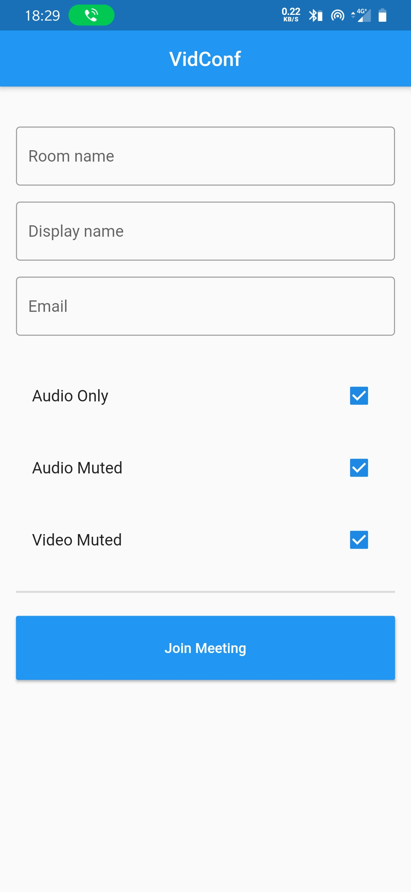
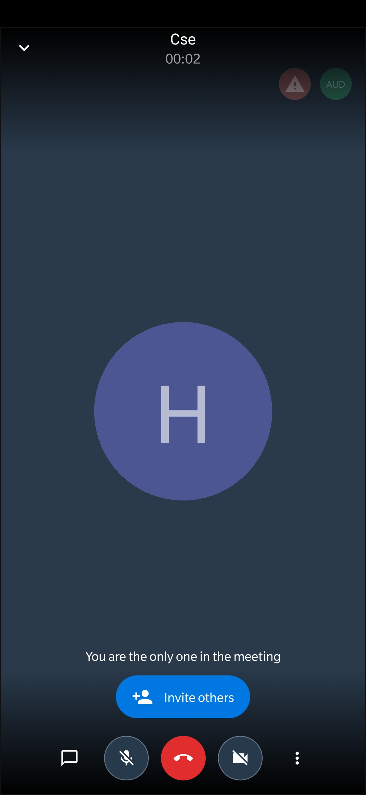

# video_conferencing_app

A video conferencing app made with flutter using jitsi SDK.

Leave a star, if you like this.

# Screenshots
<table>
  <tr>
    <td>Home screen</td>
     <td>Conference connected</td>
  </tr>
  <tr>
    <td></td>
    <td></td>
  </tr>
 </table>

## How to compile 

1. Pull the project.
2. run ``pub get``
3. run ``flutter build apk --debug``
4. then run ``flutter build apk --profile``

For split apk run ``flutter build apk --split-per-abi``

## Getting Started

This project is a starting point for a Flutter application.

A few resources to get you started if this is your first Flutter project:

- [Lab: Write your first Flutter app](https://flutter.dev/docs/get-started/codelab)
- [Cookbook: Useful Flutter samples](https://flutter.dev/docs/cookbook)

For help getting started with Flutter, view our
[online documentation](https://flutter.dev/docs), which offers tutorials,
samples, guidance on mobile development, and a full API reference.

